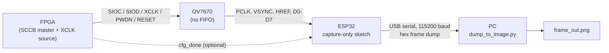

# OV7670-Camera-module
# OV7670 + ESP32 Frame Capture (FPGA-configured, RGB565)

A diagnostic capture pipeline for an **OV7670 camera module (no FIFO)**. An **FPGA** configures the sensor and supplies its clock; an **ESP32** passively samples the pixel bus, stores a downsampled frame, and dumps it over serial as hex. A **Python script** turns that dump into a viewable image.

> **This is a diagnostic tool, not a camera.** Bit-banging a full-speed OV7670 from an ESP32 gives well under 1 fps and occasionally torn lines. Its purpose is to verify that the FPGA-side camera configuration (SCCB registers, XCLK, pixel format, resolution) produces valid image data.

---

## Contents

- [How it works](#how-it-works)
- [Repository layout](#repository-layout)
- [Hardware](#hardware)
- [Wiring](#wiring)
- [ESP32 firmware](#esp32-firmware)
- [Python viewer](#python-viewer)
- [Frame dump format](#frame-dump-format)
- [Quick start](#quick-start)
- [Troubleshooting](#troubleshooting)
- [Known limitations](#known-limitations)
- [Tuning and customization](#tuning-and-customization)

---

## How it works



**Key design decision:** the FPGA is the *only* SCCB master and the *only* XCLK source. Earlier versions of the ESP32 sketch also configured the sensor and generated XCLK, which created two masters/clock drivers on the same pins and produced garbled, noisy captures. The ESP32 now only **reads** `PCLK`, `HREF`, `VSYNC` and `D0–D7`.

**Capture flow**

1. ESP32 waits for the FPGA's `cfg_done` signal (or a fixed 2.5 s delay if not wired).
2. On command (`c`), it waits for a VSYNC pulse, then reads all 240 lines of the sensor's QVGA output. For each pixel it samples two bytes (high, then low) on consecutive PCLK cycles.
3. Because a plain ESP32 lacks the RAM for a 320×240×2-byte frame (153,600 bytes), only every other row and column is stored (2×2 nearest-neighbour downsample), giving a **160×120** buffer (38,400 bytes). All real pixels are still read to stay in sync with HREF/PCLK.
4. On command (`d`), the frame is printed over serial as hex between `---BEGIN FRAME---` / `---END FRAME---` markers.
5. The Python script parses the dump, decodes RGB565, and writes an image.

---

## Repository layout

| File | Description |
|---|---|
| `ov7670_esp32_565.ino` | ESP32 (Arduino-ESP32 core 3.x) capture-only sketch |
| `dump_to_image.py` | PC-side script: serial capture or log file → PNG (numpy + OpenCV) |

The FPGA design (referenced in the sketch as `ov7670_top.v`, `ov7670_config.v`, `sccb_master`, `xclk_gen.v`) lives outside this repo. *(Add a link here if it's published separately.)*

---

## Hardware

- ESP32 dev board (plain ESP32, no PSRAM required)
- OV7670 module **without** onboard FIFO (e.g. the common 18-pin module)
- FPGA board running the camera configuration/clock design
- USB cable for the ESP32 (serial at 115200 baud)

**Required sensor configuration (set by the FPGA):**

| Setting | Value |
|---|---|
| Resolution | QVGA 320×240 (COM7 QVGA bit) |
| Pixel format | RGB565 (COM7 RGB bit set, reg `0x8C` RGB444 bit clear) |
| Output | Two bytes per pixel, high byte first |

The sketch can alternatively decode RGB444 (`xRGB` or `RGBx`) by changing `PIXEL_FORMAT` (see [Tuning](#tuning-and-customization)), but the Python viewer in this repo decodes **RGB565 only**.

---

## Wiring

> **3.3 V only. Never connect the OV7670 to 5 V.** Ground must be common between the camera, ESP32 and FPGA.

| OV7670 pin | Connects to | Notes |
|---|---|---|
| 3V3 | 3V3 | |
| GND | GND | Common ground is mandatory |
| SIOC (SCL) | **FPGA only** | Do not wire to ESP32 |
| SIOD (SDA) | **FPGA only** | Do not wire to ESP32 |
| XCLK | **FPGA only** | Do not wire to ESP32 |
| PWDN | **FPGA only** | Tied low in `ov7670_top.v` |
| RESET | **FPGA only** | Tied high in `ov7670_top.v` |
| PCLK | ESP32 GPIO25 | |
| VSYNC | ESP32 GPIO27 | |
| HREF | ESP32 GPIO14 | |
| D0 | ESP32 GPIO4 | |
| D1 | ESP32 GPIO5 | |
| D2 | ESP32 GPIO18 | |
| D3 | ESP32 GPIO19 | |
| D4 | ESP32 GPIO36 | Input-only pin |
| D5 | ESP32 GPIO39 | Input-only pin |
| D6 | ESP32 GPIO34 | Input-only pin |
| D7 | ESP32 GPIO35 | Input-only pin |
| *(optional)* FPGA `cfg_done` | ESP32 GPIO23 | Lets the ESP32 know the sensor is configured. Set `CFG_DONE_PIN` to `-1` if unwired |

**Why the pin choice matters:** the sketch reads D0–D7 directly from the GPIO input registers (`GPIO.in` for GPIO0–31, `GPIO.in1` for GPIO32–39) for speed. If you change the data pins, you **must** update `readCameraByte()` to match.

---

## ESP32 firmware

**Environment:** Arduino IDE (or PlatformIO) with **Arduino-ESP32 core 3.x**. The sketch sets the CPU to 240 MHz.

### Serial commands (115200 baud)

| Key | Action |
|---|---|
| `c` | Capture a frame and print statistics |
| `p` | Print the first 20 pixels with R/G/B split |
| `d` | Dump the entire frame as hex |
| `w` | Wait for FPGA `cfg_done` again |
| `h` | Show help |

With `AUTO_CAPTURE_ON_BOOT` enabled, the sketch captures one frame at startup and prints statistics plus the first 20 pixels.

### Frame statistics and verdicts

After each capture, `frameStats()` prints min/max/mean, the share of all-zero and full-white pixels, and a plain-language verdict:

| Verdict | Meaning |
|---|---|
| Everything is zero | Data lines not reaching the ESP32, or the FPGA isn't driving the sensor |
| Everything is full-white | Data pins floating high / disconnected |
| Padding bits set (RGB444 only) | Format mismatch with reg `0x8C`, or a byte-phase/sync problem |
| Every pixel identical | Sampling is not in sync with PCLK |
| Varied data | Looks like a real capture; dump it and view on the PC |

### Capture implementation notes

- Interrupts are disabled **per line**, not per frame, to avoid tripping the interrupt watchdog. An interrupt between lines may cost a pixel or two at a line's left edge.
- Every PCLK wait has a guard counter; a line that times out is flagged as degraded. More than 5 bad lines aborts the capture with a hint to lower `CLKRC` on the FPGA.
- VSYNC and HREF waits have timeouts (2 s and 100 ms respectively) with diagnostic messages.

---

## Python viewer

`dump_to_image.py` converts the hex dump into an image. It works either **live over serial** or from a **saved log file**.

### Install

```bash
pip install numpy opencv-python pyserial
```

(`pyserial` is only needed for live capture.)

### Usage

```bash
# Live capture from a serial port (Windows)
python3 dump_to_image.py COM3

# Live capture with a custom output name (Linux / macOS)
python3 dump_to_image.py /dev/ttyUSB0 output.png

# Convert a saved serial log instead
python3 dump_to_image.py --file dump.txt out.png
```

Defaults: port `COM3`, output `frame_out.png`, file input `frame_dump.txt`.

In live mode the script opens the port at 115200 baud, waits 2 s for the boot banner, sends `c` (capture), waits 1 s, sends `d` (dump), and reads until `---END FRAME---` (10 s timeout).

> A 160×120 frame is ~77,000 hex characters, which takes roughly 6.7 s at 115200 baud, so the default 10 s timeout leaves little margin. If you hit a timeout, raise `timeout` in `capture_frame_over_serial()`.

### Processing pipeline

1. **Parse** the dump (`parse_frame_text`) and extract `WIDTH`, `HEIGHT` and the hex rows. Other log lines are ignored.
2. **Decode** each row to big-endian RGB565 words (`rows_to_rgb565`). Optional byte-phase alignment (`align`) can salvage rows shifted by one byte: `"none"` (default), `"shift1"`, or `"auto"` (per-row, keeps whichever phase has more high-frequency detail).
3. **De-duplicate rows** (`detect_duplicate_period`): if rows repeat at a fixed vertical period (e.g. a capture that missed every other HREF), only the unique lines are kept. This is detected automatically rather than assumed.
4. **Convert** RGB565 → 8-bit BGR (`rgb565_to_bgr888`).
5. **Upscale** with nearest-neighbour to `WIDTH*4 × HEIGHT*4` (640×480 for a 160×120 frame), so missing or duplicated lines are not smoothed into detail the sensor never produced.
6. **Post-process** (`process_image`): Gaussian blur (5×5, σ=1.0) and a 180° rotation, both enabled by default to match the camera's mounting orientation. Disable with `gaussian=False` / `rotate_180=False`.

### Using it as a module

```python
from dump_to_image import dump_to_image, serial_to_image

# From a saved log
dump_to_image("dump.txt", "out.png", dedupe=True, align="auto",
              gaussian=True, rotate_180=True)

# Live from the ESP32
serial_to_image("COM3", "out.png", baud=115200)
```

---

## Frame dump format

```
---BEGIN FRAME---
WIDTH=160
HEIGHT=120
FORMAT=RGB565
<hex row 0>
<hex row 1>
...
---END FRAME---
```

Each hex row is `WIDTH × 4` characters: 4 hex digits per pixel (`RRRRRGGGGGGBBBBB`, most-significant byte first), one row of pixels per line.

---

## Quick start

1. Program the FPGA with the camera configuration design (QVGA, RGB565) and wire the camera as in [Wiring](#wiring).
2. Flash `ov7670_esp32_565.ino` to the ESP32.
3. Open a serial monitor at 115200 baud. Confirm `cfg_done HIGH` and a **"varied data"** verdict from the statistics.
4. Close the serial monitor (the port can only be used by one program at a time).
5. Run `python3 dump_to_image.py <your-port>` and open `frame_out.png`.

---

## Troubleshooting

| Symptom | Likely cause / fix |
|---|---|
| `VSYNC never went HIGH` | FPGA not programmed or running, `cfg_done` low, or VSYNC not on GPIO27 |
| `HREF timeout at line N` | `SENSOR_WIDTH/HEIGHT` don't match the FPGA's QVGA configuration |
| `PCLK timeout, too many bad lines` | PCLK is too fast for polling. Lower the PCLK on the FPGA (increase `CLKRC` divider in `ov7670_config.v`) |
| Noisy/garbled image | Check that the ESP32 isn't driving SCCB or XCLK. Capturing before configuration finished also looks like noise, so wait for `cfg_done` |
| Smooth, blended, detail-free lines | Byte-phase slip from a late PCLK sample. Try `align="auto"`; the real fix is a more reliable capture method |
| Wrong colors | Sensor format doesn't match `PIXEL_FORMAT` in the sketch, or register `0x8C` is misconfigured |
| Repeated image rows | Missed HREF pulses. The viewer's de-duplication handles it; the root cause is capture timing |
| Image upside down | Toggle `rotate_180` |
| `Did not see ---END FRAME---` | Timeout too short for the dump, wrong port, or the board reset. Raise the timeout |

---

## Known limitations

- **Polling, not hardware-timed.** `GPIO.in` polling can't guarantee every PCLK edge at the camera's full pixel clock. Expect torn lines and sub-1 fps.
- **Downsampled storage.** Output is 160×120 (2×2 nearest-neighbour from 320×240) because a plain ESP32 can't hold the full frame.
- **Config must match.** The sketch cannot configure the sensor; mismatches with the FPGA register settings show up as corrupted-looking data.
- **Viewer is RGB565-only.** The firmware can emit RGB444, but `dump_to_image.py` does not decode it.
- **Frame stats thresholds** (95% zero / white, 5% pad bits) are heuristics.

For a real fix, move to an interrupt/DMA/I2S-parallel-based capture, or a camera with onboard FIFO.

---

## Tuning and customization

Key `#define`s in `ov7670_esp32_565.ino`:

| Define | Purpose |
|---|---|
| `SENSOR_WIDTH` / `SENSOR_HEIGHT` | Real sensor output (320×240); must match the FPGA |
| `FRAME_WIDTH` / `FRAME_HEIGHT` | Stored size (default: half of sensor size) |
| `PIXEL_FORMAT` | `PIXEL_FORMAT_RGB565` (default) or `PIXEL_FORMAT_RGB444` |
| `RGB444_USE_RGBX` | RGB444 byte order (`0x8C=0x03` → RGBx, `0x8C=0x02` → xRGB) |
| `CFG_DONE_PIN` / `CFG_DONE_TIMEOUT_MS` | FPGA ready signal and fallback timeout (`-1` to disable the pin) |
| `AUTO_CAPTURE_ON_BOOT` | Capture one frame at startup |

**Storing the full frame:** on a PSRAM board (e.g. WROVER), set `FRAME_WIDTH/HEIGHT` equal to the sensor size and allocate `frameBuffer` with `heap_caps_malloc(..., MALLOC_CAP_SPIRAM)`.

---

## License

*Add your license here (e.g. MIT).*
